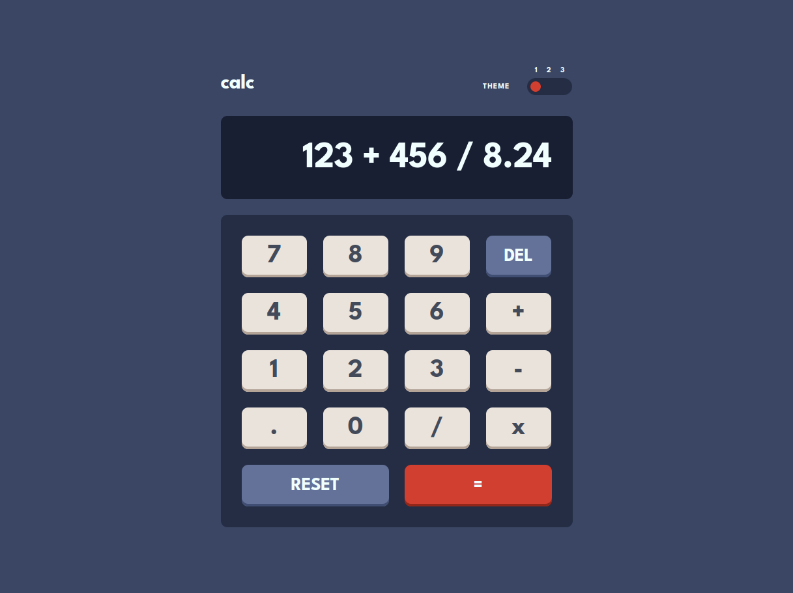

# Frontend Mentor - Calculator app solution

This is a solution to the [Calculator app challenge on Frontend Mentor](https://www.frontendmentor.io/challenges/calculator-app-9lteq5N29).

## Table of contents

- [Overview](#overview)
  - [The challenge](#the-challenge)
  - [Screenshot](#screenshot)
  - [Links](#links)
- [My process](#my-process)
  - [Built with](#built-with)
  - [Useful resources](#useful-resources)
- [Author](#author)

## Overview

### The challenge

Users should be able to:

- See the size of the elements adjust based on their device's screen size
- Perform mathmatical operations like addition, subtraction, multiplication, and division
- Adjust the color theme based on their preference

### Screenshot

### Links

- [Solution](https://github.com/kxrn0/Calc)
- [Live](https://kxrn0.github.io/Calc)

## My process

### Built with

- Semantic HTML5 markup
- CSS custom properties
- Flexbox
- CSS Grid
- Mobile-first workflow
- [React](https://reactjs.org/) - JS framework

### Useful resources

- [jsfiddle](https://jsfiddle.net/) - Great for quickly prototyping ideas.

## Author

- Frontend Mentor - [@kxrp](https://www.frontendmentor.io/profile/kxrp)
- Reddit - [by me](https://old.reddit.com/user/_by_me)